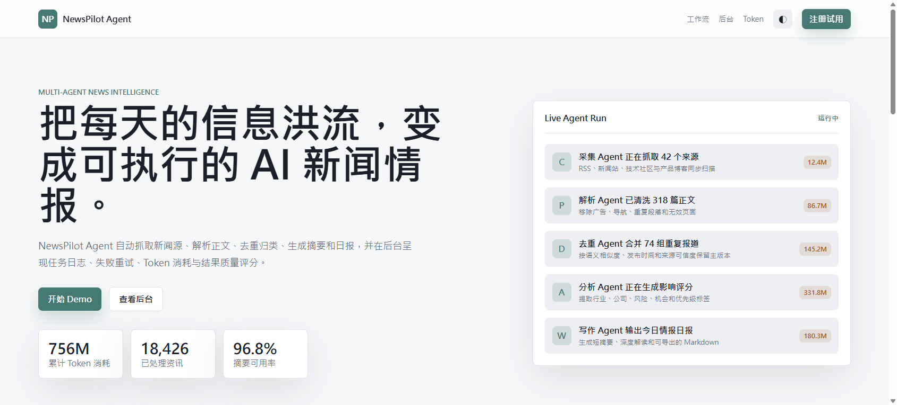
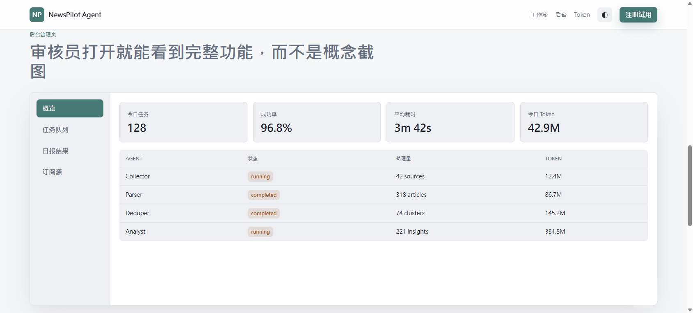
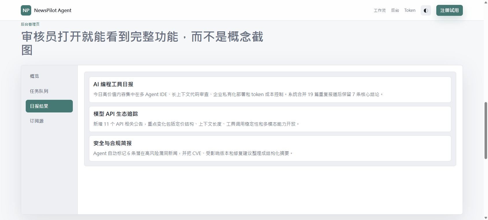
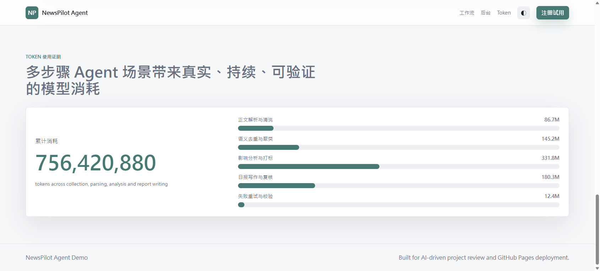

# NewsPilot Agent

NewsPilot Agent is a static, GitHub Pages friendly demo for an AI-driven news intelligence product. It shows a landing page, interactive mock registration, admin dashboard, multi-agent workflow, daily report results, source settings, and token usage evidence.

**Live demo:** https://csnomod-afk.github.io/newspilot-agent/



## Demo behavior

This repository is a front-end demo. It does not call a real AI API, does not require an API key, and does not consume real tokens. The token dashboard uses simulated usage data to show how a production multi-agent workflow would present model consumption.

A production version can connect the same interface to Xiaomi MiMo API or another model API by adding:

- A backend job runner for scheduled news collection.
- API credentials stored on the server side.
- Real agent steps for collection, parsing, deduplication, analysis, and report writing.
- Persistent storage for tasks, logs, reports, and token usage.

## Screenshots

### Admin Dashboard



### Generated Reports



### Token Usage Board



## Why this project exists

The demo is built for project review scenarios where reviewers need to see a complete AI/Agent product instead of only a text description. It highlights:

- A real product landing page.
- A usable registration entry with local mock login.
- An admin dashboard with task queue, reports, source settings, and token usage.
- A clear multi-agent workflow: collector, parser, deduper, analyst, writer.
- Static deployment support for GitHub Pages, Vercel, Netlify, or any CDN.

## Run locally

Open `index.html` directly in a browser, or serve the folder with any static server:

```bash
python -m http.server 5173
```

Then visit:

```text
http://localhost:5173
```

## Deploy to GitHub Pages

1. Push this folder to a GitHub repository.
2. Open the repository settings.
3. Go to Pages.
4. Select `Deploy from a branch`.
5. Select the default branch and root folder.
6. Save and wait for the Pages URL.

## Suggested project URL

Live demo:

```text
https://csnomod-afk.github.io/newspilot-agent/
```
